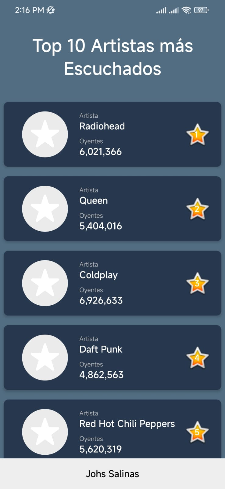
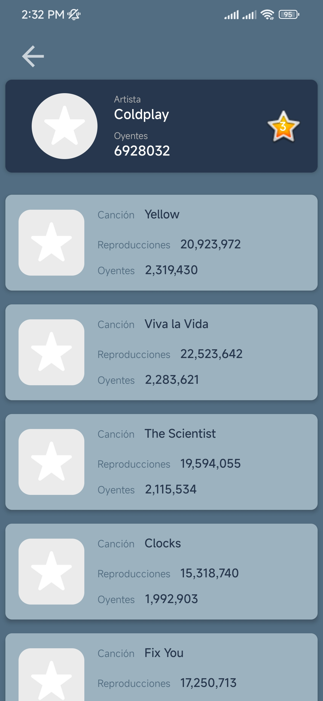

# Top Artistas

Este proyecto es una aplicación móvil para Android que permite a los usuarios explorar y descubrir diferentes artistas musicales. El propósito de la aplicación es brindar una plataforma intuitiva y fácil de usar para que los usuarios puedan encontrar información sobre sus artistas favoritos, como su nombre, número de oyentes y una imagen representativa

## Características

- Detalles del artista: La aplicación muestra información detallada sobre cada artista, incluyendo su nombre, número de oyentes y una imagen representativa.
- Detalles de las primeras 5 canciones del artista seleccionado, tal como su nombre, oyentes, reproducciones y una imagen representativa.
- Interfaz intuitiva y atractiva: La aplicación cuenta con una interfaz de usuario moderna y atractiva que facilita la navegación y la búsqueda de artistas.

## Tecnologías utilizadas

- Lenguaje de programación: Java
- Framework: Android SDK (para el desarrollo de aplicaciones Android)
- Librerías y dependencias:
  - Glide: Para cargar y mostrar imágenes de forma eficiente.
  - Volley: Para realizar peticiones HTTP y consumir APIs de manera sencilla.
  - CardView: Para crear vistas de tarjetas con esquinas redondeadas.
  - RecyclerView: Para mostrar listas de elementos de manera eficiente y personalizable.
  - RoundedImageView: Para mostrar imágenes con bordes redondeados.
- Otras tecnologías utilizadas: XML para la creación y diseño de la interfaz de usuario en Android.

## Estructura del proyecto

El proyecto sigue una estructura de carpetas y archivos típica de una aplicación Android. A continuación, se describe brevemente la estructura principal:

- app: Esta carpeta contiene los archivos específicos de la aplicación, incluyendo el código fuente Java y los recursos de la interfaz de usuario.
  - src: Aquí se encuentra el código fuente Java de la aplicación, organizado en paquetes según las diferentes funcionalidades.
  - res: Contiene los recursos de la interfaz de usuario, como diseños XML, imágenes y archivos de traducción.
  - manifests: Contiene el archivo AndroidManifest.xml, que especifica la configuración y permisos de la aplicación.
- build.gradle: Archivo de configuración de Gradle para la compilación y construcción del proyecto.
- gradle: Carpeta que contiene los archivos de configuración de Gradle.
- settings.gradle: Archivo de configuración de Gradle que especifica los módulos incluidos en el proyecto.

## Instalación

Para comenzar a utilizar este proyecto, sigue los siguientes pasos:

1. Clona este repositorio en tu máquina local utilizando el siguiente comando:

    ```bash
    git clone https://github.com/johssalinas/top_artistas.git
    ```

2. Abre Android Studio y selecciona la opción "Open an existing Android Studio project".

3. Navega hasta la carpeta del proyecto clonado y selecciona la carpeta raíz del proyecto.

4. Android Studio importará automáticamente el proyecto y descargará las dependencias necesarias.

5. Espera a que la sincronización y la construcción del proyecto se completen.

6. Una vez que el proyecto esté listo, puedes ejecutarlo en un emulador o dispositivo Android.

## Uso

1. Para utilizar esta aplicación, sigue los siguientes pasos:

- Abre la aplicación en tu dispositivo Android.
- En la pantalla principal, encontrarás una lista de los 10 artistas más escuchados.

    

- Selecciona alguno de los artistas para ver sus 5 canciones más escuchadas.

   

## Contacto

Si tienes alguna pregunta o inquietud relacionada con este proyecto, puedes contactarme a través de [johssalinas2work@gmail.com](mailto:johssalinas2work@gmail.com).

¡Gracias por tu interés en este proyecto!

### Johs Salinas
